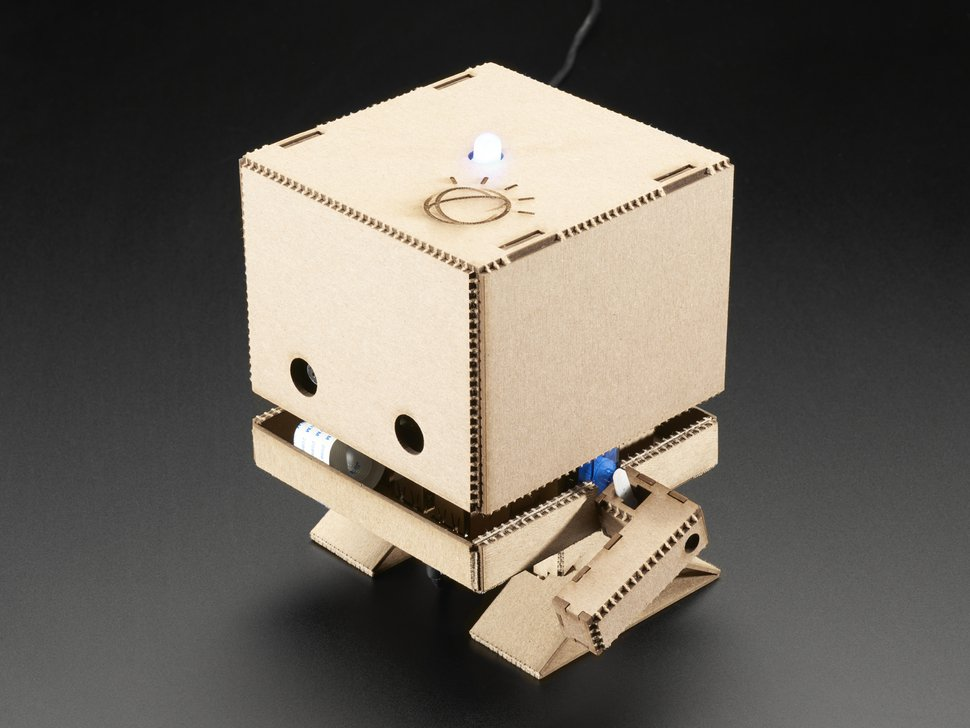

# TJBot_Workshops

Quelques workshops autour du TJBot en utilisant NodeRed en Français

## Introduction au TJBot

TJBot est né fin 2016 au sein d’IBM Research, d’une volonté de créer un projet à des fins éducatives et démonstratives utilisant les différents services IBM Watson. Il a été créé par Maryam Ashoori, IBM Research AI.Le nom «TJBot» est un hommage à Thomas J.Watson, le premier président et CEO d’IBM. C’est un projet en constante évolution qui bénéficie des apports de la communauté open source.

Tout est à faire soi-même, de l’assemblage des compo- sants électroniques à la programmation logicielle en passant par la fabrication du robot, en carton ou en plastique selon la méthode choi- sie. TJBot peut parler, converser, analyser du texte et des images mais aussi interagir en bougeant le bras ou en allumant sa LED.

## Workshop 

### Entraînement du robot a comprendre l’humain  aka Watson Assistant

Dans ce workshop, nous allons apprendre à entrainer le TJBot à comprendre et converser avec un humain. Nous allons lui demander de bouger son bras, la météo...

###  Entraînement du robot a reconnaître des produits aka Watson Visual Recognition

Dans ce workshop, nous allons apprendre à l'entrainer à reconnaitre des objets/produits.

### Reconnaître Genre et Age d'une personne

Dans ce dernier workshop, nous allons 

